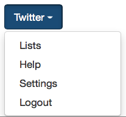

# Bootstrap入門
今回はBootstap入門を行います。
BootstrapはCSSのフレームワークのことで、おしゃれなサイトやかっこいいボタンを簡単に作ることができます。
また、Bootstrapを用いることでブラウザごとの対応や、レスポンシブなデザイン対応も容易になります。

本記事ではBootstrapでどんなことができるのかをサンプルコードとともに紹介していきます。

## 導入
Bootstapの導入について説明します。
[公式サイト](http://getbootstrap.com/getting-started/)
を開いてGetting started>Downloadで
「Download Bootstrap」のボタンを押しましょう。
なお、本記事作成時のBootstrapのバージョンは3.3.5です。

下記のHTMLをコピーし、index.htmlファイルを作成してください。
以降ではこのindex.htmlファイルを基にしてコーディングを行います。

```html
<!DOCTYPE html>
<html lang="ja">
  <head>
    <meta charset="utf-8">
    <meta http-equiv="X-UA-Compatible" content="IE=edge">
    <meta name="viewport" content="width=device-width, initial-scale=1">
    <title>Template</title>
    <link rel="stylesheet" href="https://maxcdn.bootstrapcdn.com/bootstrap/3.3.5/css/bootstrap.min.css">
  </head>

  <body>

    <!-- Type your code here -->

    <script src="https://code.jquery.com/jquery-2.1.4.min.js"></script>
    <script src="https://maxcdn.bootstrapcdn.com/bootstrap/3.3.5/js/bootstrap.min.js"></script>
  </body>
</html>
```

Bootstrapは[公式サイト](http://getbootstrap.com/getting-started/)
のGetting started > Downloadからでもダウンロードできます。

### グリッドシステム
index.htmlに、下記のHTMLを写してください。

```html
<div id="header" class="container" style="background:gray;">header</div>
<div class="container">
	<div class="row" >
		<div class="col-sm-3" style="background:red;">Side1</div>
		<div class="col-sm-6" style="background:blue;">Main</div>
		<div class="col-sm-3" style="background:green;">Main2</div>
	</div>
</div>
<div id="footer" class="container" style="background:gray;">footer</div>
```

以下の画像のようなものがブラウザに表示されましたか？


表示されたらブラウザの幅を狭めてみてください。
ブラウザ幅に応じてカラムの並び方が自動的に変わるのが分かると思います。
これはグリッドシステムと呼ばれるものでデバイス幅に応じて構成を自動的に変更してくれます。
col-3やcol-6は割合を示していて、合計で12になるようにします。

幅が狭くなっても並列で並べたい場合もあるでしょう。
そういった場合は以下のようにclassを指定することで幅が狭くなった場合でも並列を維持することができます。
MainとMain2はブラウザの幅が狭くなっても並列で並ぶようになったはずです。

```html
<div class="col-sm-6 col-xs-6" style="background:blue;">Main</div>
<div class="col-sm-3 col-xs-6" style="background:green;">Main2</div>
```

classのxsやsmは画面幅を意味していて、他にmd、lgなどがあります。
対応する画面サイズはxs、sm、md、lgの順に大きくなっていきます。
このようなレスポンシブデザインに関しては
[2章](https://github.com/dit-rohm/textbook/blob/master/2/how_to_design_responsively.md)
でも勉強しましたね。Bootstrapを用いることで様々な画面幅に簡単に対応できるようになりました。

グリッドシステムについてもっと知りたい方は以下のURLを参照してください。
> http://getbootstrap.com/css/#grid

### ナビゲーションバー
まずは様々なサイトで使われているナビゲーションバーを作成しましょう。以下のHTMLのコードをさきほど作成したindex.htmlのbodyに追記してください。

```html
<nav class="navbar navbar-inverse navbar-fixed-top">
  <div class="navbar-header">
    <a class="navbar-brand" href="">DIT</a>
  </div>
  <ul class="nav navbar-nav">
    <li><a href="">ABOUT</a></li>
    <li class="active"><a href="">MENTOR</a></li>
    <li><a href="">NEWS</a></li>
    <li><a href="">FAQ</a></li>
  </ul>
</nav>
```


写真のようなかっこいいナビゲーションバーはできましたか？
ここで大事なのは、このナビゲーションバーの作成にCSSを触っていないということです。Bootstrapを使えばクラス名を指定するだけでおしゃれなサイトが作れるようになります。
[4章](https://github.com/dit-rohm/textbook/blob/master/4/html-css.md)で作成したときのナビゲーションバーと比較するのもいいでしょう。

もっとナビゲーションバーをカスタマイズしたいという方は以下を参照してください。
> http://getbootstrap.com/components/#navbar

なお、設定したナビゲーションバーに要素が重なる場合は以下のスタイルで調整しましょう。

```html
<body style="padding-top:70px">
```

### ボタン
次はBootstrapを使ってボタンを作ります。
以下のコードをindex.htmlに追記してください。

```html
<button type="button" class="btn btn-lg btn-primary">Primary</button>
```


今まで左のようなボタンが、クラスを指定するだけで右のようなおしゃれなボタンに変わりました。

詳しい使い方や他のボタンのクラス指定法を知りたい方は以下のURLを参照してください。
> http://getbootstrap.com/css/#buttons

### アイコン
以下のURLを開いてください。
> http://getbootstrap.com/components/#glyphicons

ここにはBootstrapにあらかじめ用意されているアイコンの一覧が表示されています。必要に応じて使いましょう。

使い方は以下のコードのようにclassを指定するだけです。

```html
<p><i class="glyphicon glyphicon-asterisk"></i>アスタリスク</p>
```

表示すると以下のようになります。

---

---

### ドロップダウンメニュー
次はドロップダウンメニューを作成しましょう。
ドロップダウンメニューとは次のようなものです。



ドロップダウンメニューは以下のコードで作成することができます。

```html
<div class="btn-group">
	<button class="btn btn-primary dropdown-toggle" data-toggle="dropdown">
		Twitter <span class="caret"></span>
	</button>
	<ul class="dropdown-menu">
		<li><a href="">Lists</a></li>
		<li><a href="">Help</a></li>
		<li><a href="">Settings</a></li>
		<li><a href="">Logout</a></li>
	</ul>
</div>
```

コードでは、ドロップダウンメニューのもとのボタンを定義したあとにリストでメニューを定義しています。
細かい設定は以下のURLを参照してください。

> http://getbootstrap.com/javascript/#dropdowns

### アラート
アラートを実装しましょう。
アラートとは次の画像のようなものになります。


アラートは以下のコードで作成することができます。

```html
<div class="alert alert-info">
  <button class="close" data-dismiss="alert">&times;</button>
  hoge
</div>
```

「×」を押すと消せることを確認してください。
色の変更など細かい設定は以下のURLを参照してください。

> http://getbootstrap.com/javascript/#alerts

### フォーム
最後にフォームの実装を行います。
よくあるSNSのログインフォームを作ってみましょう。
作成するフォームは次の画像のようなものになります。


```html
<form class="form-horizontal">
  <div class="form-group">
    <label for="exampleInputEmail1" class="col-sm-2 control-label">Email address</label>
    <div class="col-sm-10">
      <input type="email" class="form-control" id="exampleInputEmail1" placeholder="Email">
    </div>
  </div>
  <div class="form-group">
    <label for="exampleInputPassword1" class="col-sm-2 control-label">Password</label>
    <div class="col-sm-10">
      <input type="password" class="form-control" id="exampleInputPassword1" placeholder="Password">
    </div>
  </div>
  <div class="form-group">
    <div class="col-sm-offset-2 col-sm-10">
      <button type="submit" class="btn btn-default">Submit</button>
    </div>
  </div>
</form>
```

Bootstrapのグリッドシステムを使うことでフォームのレイアウトが簡単にできましたね。画面幅を狭めるとラベルとフォームが縦に整列することも確認してみてください。

## まとめ
Bootstrapを使うことで簡単に見た目をカスタマイズできることが分かりましたか？
今後はBootstrapを用いてかっこいいサイトを作ることに挑戦してみてください！
