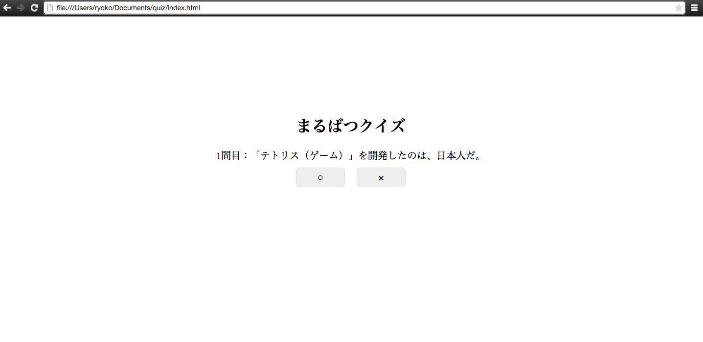

# まるばつクイズを作ろう

JavaScriptの授業第２回目です。
今回は前回のおみくじを利用してまるばつクイズを作ります。
前回よりもJavaScriptが難しくなりますが、がんばっていきましょう。

今回のまるばつクイズの仕様は以下のとおりです。

* 問題は10問
* まるかばつで答える
* 最後まで答えると正解数がでる

イメージは以下の図のような形です。デザインは時間があれば好きなようにCSSをいじってみましょう。




それではソースを見てみましょう。

## HTMLの基本仕様
`<head>`の部分の記述は覚えていますでしょうか。必要な記述事項としては

* 文字コード
* CSSファイルの呼び出し
* JavaScriptファイルの呼び出し
* タイトル

でしたね。わからなくなったら前回のテキストやリファレンスを参考にしてください。
それでは次は`<body>`の中身です。必要な`div`要素は以下のとおりです。これをもとに必要な文章を正しい場所に記述してください。

* `div class="wrapper"` : 全体を包むラッパークラス
* `div class = "problem"` : 問題を表示する部分
* `div class = "selection"` : まるとばつを表示する部分

ここで、JavaScriptに対応するボタンについて説明します。ボタンの書き方は以下のようにしてください。

```html
<input type="button" class="button" value="○" onclick="seikai(1)">
<input type="button" class="button" value="×" onclick="seikai(2)">
```
`type`としてボタンを指定し、どちらも同じ仕様のボタンにしたいため`class`で命名しCSSのデザインを適用させます。`value`にはボタンの文字を書きます。`onclick`ではまるボタンを押したら1を引数として渡し、ばつボタンを押したら2を引数として渡すようにします。
前回ではJavScriprの方で`addEventListener`でクリックされた時の動作を記述していましたが、今回はhtmlでクリックの時の動作をJavaScriptに直接渡すようにしています。


## CSSの基本仕様

htmlで指定した`div`要素をそれぞれ中央寄せにしたり幅を決めたりしましょう。ここは好きに
ボタンのデザインとマウスオーバーした時の動作は以下のようにしましょう。

```css
.button {
  background-color: #EEE;
  border: 1px solid #DDD;
  border-radius: 8px;
  color: #111;
  width: 100px;
  height: 40px;
  margin: 10px;
  font-size: 20px;
  outline: none;
}
.button:hover {
  background-color: #a1d7e0;
  cursor: pointer;
}
```
* border-radius : 縁取りの丸み
* outline : ボタン選択の際の囲み
* cursor : カーソルの種類の指定

## JavaScriptの基本仕様
プログラムの流れを記述しておきます。

1. 問題を保存する配列と変数を作る
1. ウィンドウを読み込んだときの最初の処理である1問目を表示する
1. まるかばつのボタンが押されたら次の問題を表示すると共に正解判定をする
1. もし10問目が終われば正解数の表示とまるばつのボタンを見えなくする

#### 手順１
まず、問題と解答を保存する配列を作ります。今回は問題は10問でまるの場合1を、ばつの場合2をそれぞれ`qa[i][1]`に入れておきます。

```javascript
var qa = [ 
  ['「テトリス（ゲーム）」を開発したのは、日本人だ。', 2],
  ['生きている間は、有名な人であっても広辞苑に載ることはない。 ', 1],
  ['現在、2000円札は製造を停止している。', 1],
  ['パトカーは、取り締まっている最中であれば、どこでも駐車違反になることはない。', 2],
  ['昆虫の中には、口で呼吸する昆虫もいる。', 2],
  ['一般的に体の水分は、男性より女性のほうが多く含まれている。', 2],
  ['たとえ１ｃｍの高さであっても、地震によって起こるのは全て「津波」である。', 1],
  ['1円玉の直径は、ちょうど１ｃｍになっている。', 2],
  ['塩はカロリー０である。', 1],
  ['「小中学校は、PTAを作らなければならない」と法律で定められている。', 2]
];
```
次に今回使う変数を指定します。

* 今何問目にいるのかを保存する変数
* 正解数を保存する変数

#### 手順２
次はウィンドウを読み込んだ時の動作です。ウィンドウを読み込んだ時点で最初の問題が表示されるところまで書いていきます。
ウィンドウの読み込みは前回もやりましたが、`window.onload`ほにゃららでしたね。
idを取ってくるのは`document.getElementById`で、その内容を書き換えるの続けて`innerHTML`というものを記述します。
表示する内容は「1問目：問題」という形です。
問題の番号は今何問目にいるのかを保存する変数を使い、問題は配列から取ってきましょう。

#### 手順３
次は`quiz()`という関数を作りましょう。
そこには次の問題を表示する部分を記述します。
なので変数で定義した今何問目にいるのかを保存する変数を1ずつ増やしてください。

そしてクリック時の答え判定です。こちらは`seikai(btnNo)`という関数を作りましょう。
問題を変えるタイミングはボタンをクリックした時なので、HTMLの方で指定したようにクリックしたときにまるボタンだと1を引数として受け取り、ばつボタンの場合は引数として2を受け取ります。
そしてその引数を配列の2つめに入っている変数と比較して同じの場合正解数を保存する変数を増やすという形になっています。
また、今何問目に入るのかを保存する変数が9になると10問目の終了となるので、クイズを終了させます。
こちらも終了させる関数end()を作り、もし10問目が終わればend()を呼び出すといった形にしましょう。
これらはif文を用いて、判定しましょう。

#### 手順４
終了画面として、正解数を表示するとともにボタンを見えなくします。
ボタンを見えなくする書き方は以下を参考にしてください。
ここで`document.getElementsByClassName`というものが新しく出てきています。
これはidの代わりにclassを取ってくるものです。

```javascript
//ボタンを見えなくする関数
function changeVisibility(){
  var sl = document.getElementsByClassName("button");
  for (var i = 0; i < sl.length; i++) {
    sl[i].style.visibility = "hidden";
  }
}
```

