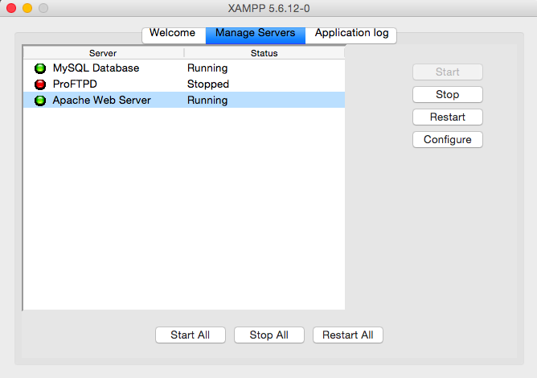

# XAMPPをインストールしよう

## XAMPPとは

XAMPP(ザンプ)とはWebアプリケーションの実行に必要なフリーソフトウェアをパッケージでまとめたものです。Apache(Webサーバ)、MySQL(データベースサーバ)、PHP・Perl(Webプログラミング言語)といった主要なソフトウェアを簡単に使うことができます。  
秋学期の勉強会ではこのXAMPPの環境のなかでWebサービスを作っていきます。


## XAMPPのインストール

まずは<a href="https://www.apachefriends.org/jp/index.html" target="_blank">こちらのサイト</a>にアクセスしてWindowsやMacなど適当な方をクリックして、最新バージョンを落としてください。
勉強会に参加している方はUSBでインストーラを配布いたします。

  
  
次にインストーラを起動すれば、基本的にインストーラの指示通りに次へをクリックし進めていけばインストールが完了すると思います。

それぞれXAMPPがインストールされた場所は以下になっているかと思います。

* Macの場合：/Applications/XAMPP
* Windowsの場合：C:¥xampp

## XAMPPの起動

それでは実際にXAMPPを使っていきましょう。  
まず、XAMPPを起動してください。そうするとこのような画面になると思います。(バージョンなどによって画面は異なります)

  

スタートボタンをクリックしてApacheとMySQLを動作させてください。これでXAMPPの起動は完了です。
ここまで完了したら、一旦こちらにアクセスしてください。[http://localhost](http://localhost)  
以下のようなXAMPPの画面が表示されたら正しく動いています。


> #### 参考　もしApacheが起動できなかったら
> 他のアプリ（主にSkype）が80番のポートを使っている可能性が大きいので、タスクマネージャ等でポートの確認をしてそのアプリを一旦落としてください。

## XAMPPの設定

次にXAMPPで正しく開発ができるように各種設定をしていきます。

### 管理者権限の設定

ここはMacの人のみ行ってください。まずはこれから開発をしていくフォルダをいじれるように管理者権限の設定を行っていきます。これをしないとフォルダにアクセスすることができないためです。htdocsフォルダに管理者権限を与えていきます。

####Macの場合
/Applications/XAMPP/xamppfiles/htdocs 

* フォルダを右クリックし情報を見るを選択
* 共有とアクセス権をクリックし右下の鍵のアイコンをクリックしパスワードを入力
* adminとeveryoneに対して読み書きをするに変更

もしくはターミナルのアプリにて`sudo chown `whoami` "/Applications/XAMPP/xamppfiles/htdocs/"`と打ってパスワードを入れてください。


### HelloWorldをやってみる

それではHello Worldをしてみましょう。同フォルダにSublime Textなどのエディタを使って`hello.php`を作成してください。内容は以下です。

```php
<?php
    echo "Hello World!";
?>
```

できたら、[http://localhost/hello.php](http://localhost/hello.php)にアクセスしてください。Hello Worldと正しく表示できましたか？これで基本的なXAMPPの設定は完了です。それでは次に日本語の設定など細かい設定を説明していきます。


### php.iniの設定

ここではPHPを扱う上での日本語の設定をしていきます。まずはphp.iniを編集していきます。ファイルの場所は以下に示しておきます。このファイルをSublime Textなどのエディタで開いてみましょう。以下の設定を書き換えていきます。上の部分が元からあるので、下のようにその行を書き換えてください。その行を探すときはエディタ上でキーワードで検索するとすぐに出てくるかと思います。  
これをする理由としては、以下のコードをみてもわかる通り、PHPファイルをアップした際に文字化けを起こす可能性があるので、文字の設定を行うためです。他にもその他各種設定を変えていきます。

以下の設定を書き換えたファイルが[こちら](./sample/php.ini)になりますので、簡単にしたい方はこちらをコピペもしくはファイルの置き換えをしてください。

* Macの場合：/Applications/XAMPP/etc/php.ini
* Windowsの場合：C:¥xampp¥php¥php.ini

* 文字エンコードの設定  
`;default_charset = "iso-8859-1"`  
`default_charset = "UTF-8"`

* 言語設定のデフォルトを日本語に  
`;mbstring.language = Japanese`  
`mbstring.language = Japanese`

* 拡張モジュールを有効に  
`;extension=php_mbstring.dll`  
`extension=php_mbstring.dll`

* 内部文字エンコードの設定  
`;mbstring.internal_encoding = EUC-JP`  
`mbstring.internal_encoding = UTF-8`

* 入力文字エンコードを自動に  
`;mbstring.http_input = auto`  
`mbstring.http_input = auto`

* 出力文字エンコードを変換しないように  
`;mbstring.http_output = SJIS`  
`mbstring.http_output = pass`

* 入力エンコード変換を有効に  
`;mbstring.encoding_translation = Off`  
`mbstring.encoding_translation = On`

以上ができれば、一度Apacheを停止し、再度スタートさせてから、先ほど作成した`hello.php`を以下に書き換えてみて、日本語が正しく表示されるかを確認してください。

```php
<?php
    echo "Hello World!";
    echo "こんにちは！";
?>
```

## 終わりに
以上がXAMPPの基本的な設定となります。これで大体の設定は完了したので、すぐにでもWeb開発ができる状態です。あとは実際にコードを書いてWebサービスを実現していきましょう。環境を整える上で様々なエラーがあるあもしれませんが、近くにいるメンターに聞いたり、Google先生がほとんどのエラーを解決してくれるので、ご活用ください。

## おまけ
以下はより安全にXAMPPを使うために必要な設定となります。先ほど設定したもののまま例えば実際にサイトを運営したい、となるとセキュリティの面では何も設定していないので攻撃され放題の状況です。（今は自分の環境でのみ動くのでセキュリティの設定はしなくても問題ありません。）なので、興味のある方、または実際にサイトを動かしてみたいといった方は以下のセキュリティの設定をしてください。

### 管理者の設定

管理者を設定していきます。
XAMPPの設定画面にアクセスしてください。Macの方は[http://localhost/xampp/](http://localhost/xampp/)、Windowsの方は[http://localhost/security/splash.php](http://localhost/security/splash.php)になります。
左側のカラムのセキュリティをクリックしてください。ここでステータスを見ると要注意となっているのがわかるかと思います。この設定を変更して安全にしていきます。

####Macの場合
ターミナルのアプリを開けてください。以下を順に実行してください。まずはセキュリティを安全にしていきます。

* `sudo /Applications/XAMPP/xamppfiles/xampp security` を入力
* `> Do you want to set a password?[yes]` Enterを押す
* `> Password:` 設定したいパスワードを入力する
* `> Password(again):` 先ほど入力したパスワードを再入力
* `> Normaly Do you want to change the password anyway?[yes]` Enterを押す

次はMySQLについて

* `sudo /Applications/XAMPP/xamppfiles/bin/mysqladmin -u root -p password 設定したいパスワード`
* `> Enter password` Enterを押す

これで全てのステータスが安全に変わります。試しにもう一度http://localhost/xampp/にアクセスしてください。ユーザ名とパスワードが聞かれるかと思うのでユーザ名はxampp、パスワードは先ほど設定したものを入れてください。

#### Windowsの場合

[http://localhost/security/splash.php](http://localhost/security/splash.php)の左側のセキュリティタブのページにて[http://localhost/security/xamppsecurity.php](http://localhost/security/xamppsecurity.php)のリンクをクリックしてください。

  

このようなページになるかと思うので、上のMySQLの部分と下の.htaccessの部分いずれもパスワードを設定してください。それが完了したら、もう一度左側のセキュリティタブをクリックすると、今度はユーザ名とパスワードを聞かれるので、先ほど設定したものを入力すれば全てのステータスが安全に変わっていることが確認できると思います。

> #### 参考　もしログインできなかったら
> C:¥xampp¥phpmyadminの中の`config.inc.php`のファイルを編集します。以下を参考にしてください。

>```php
$cfg['Servers'][$i]['auth_type'] = 'config';
$cfg['Servers'][$i]['user'] = 'root';
$cfg['Servers'][$i]['password'] = '先ほど設定したパスワード';
```


### phpmyadminを見る

今回の開発ではphpmyadminと呼ばれるブラウザ上でデータベースを操作したりすることのできるツールを使用していきますphpMyAdminにアクセスしましょう。[http://localhost/phpmyadmin/index.php](http://localhost/phpmyadmin/index.php)
ここでもユーザ名とパスワードが聞かれるので、ユーザ名はroot、パスワードは先ほど設定したものを入れてください。今後はこちらのページを使ってデータベースの操作を行っていくので覚えておいてください。

