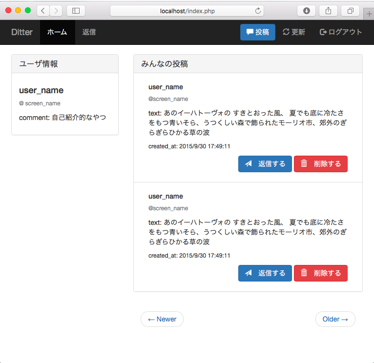
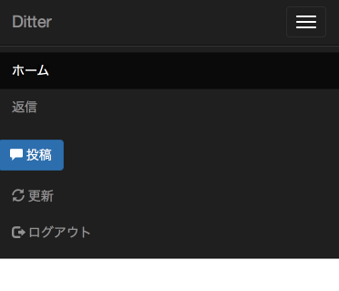
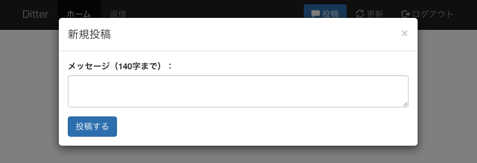
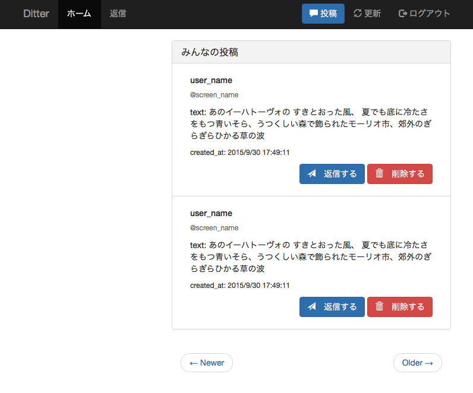
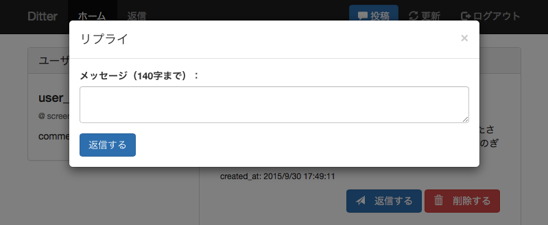
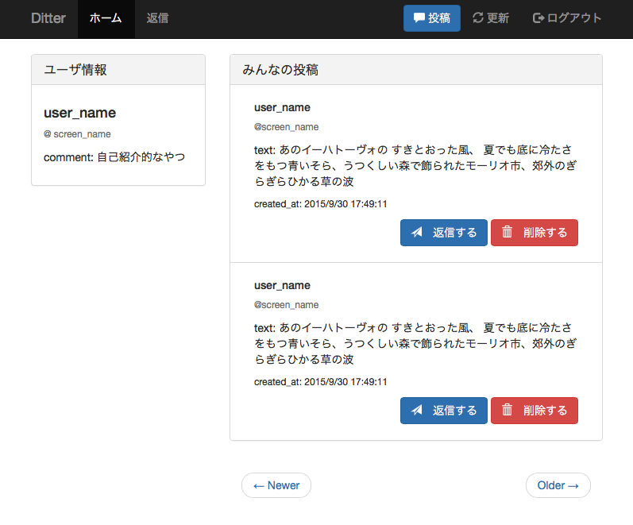
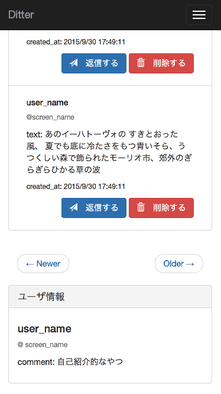

# トップページの作成
## はじめに
本記事ではトップページを作成します。
トップページでは事前準備で用意した`htdocs/index.php`を編集して
「ナビゲーションバー」、「新規投稿」、「みんなの投稿」、「返信画面」そして「ユーザ情報」などを表示します。
ページの装飾にはBootstrapを用いているので分からないかた、
不慣れな方は公式の[ドキュメント](http://getbootstrap.com)や
[入門記事](https://github.com/dit-rohm/textbook/blob/master/spring/10/bootstrap.md)を読んでください。
本記事では最終的には以下のようなページになることが目標です。

#### PC



#### モバイル


## ナビゲーションバー
ページ上部のナビゲーションバーを作成します。

`<body>`以下にあるHello Worldを削除します。

#### index.php

```html
<h1>Hello World</h1>
```

そして`<body>`以下に次のHTMLソースを写しましょう。

#### index.php

```html
<body>
<!-- HTML部分はここに書きます -->
<!-- Fixed navbar -->
<style>
  body {
    padding-top: 70px;
  }
</style>
<nav class="navbar navbar-inverse navbar-fixed-top">
  <div class="container">
    <div class="navbar-header">
      <button type="button" class="navbar-toggle collapsed" data-toggle="collapse" data-target="#navbar" aria-expanded="false" aria-controls="navbar">
        <span class="sr-only">Toggle navigation</span>
        <span class="icon-bar"></span>
        <span class="icon-bar"></span>
        <span class="icon-bar"></span>
      </button>
      <a class="navbar-brand" href="/">Ditter</a>
    </div>
    <div id="navbar" class="navbar-collapse collapse">
      <ul class="nav navbar-nav">
        <li class="active"><a href="/">ホーム</a></li>
        <li><a href="/reply.php">返信</a></li>
      </ul>
      <ul class="nav navbar-nav navbar-right">
        <li>
          <!-- Button trigger modal -->
          <button type="button" class="btn btn-primary navbar-btn" data-toggle="modal" data-target="#postModal">
            <span class="glyphicon glyphicon-comment" aria-hidden="true"></span> 投稿
          </button>
        </li>
        <li>
          <a href=""><span class="glyphicon glyphicon-refresh" aria-hidden="true"></span> 更新</a>
        </li>
        <li>
          <a href=""><span class="glyphicon glyphicon-log-out" aria-hidden="true"></span> サインアウト</a>
        </li>
      </ul>
    </div>
  </div>
</nav>
```

最初に`padding-top: 70px;`とスタイルを定義しているのは、
ナビゲーションバーが`fixed`されているため、
それ以下の要素がナビゲーションバーに被らないようにするためです。

続く、`<nav class="navbar navbar-inverse navbar-fixed-top">`でナビゲーションバーを作成しています。
クラスが何を指しているのか分からない方は`bootstrap navbar`などで検索すると良いでしょう。
今回では`navbar navbar-inverse`で黒いナビゲーションバーになるように設定し、
`navbar-fixed-top`で常に画面上部にナビゲーションバーがあるように設定しています。

ナビゲーションバー全体の設定が終わったら次にナビゲーションバー内のヘッダーと要素について記述します。
ヘッダーは`<div class="navbar-header">`内で、
ナビゲーションバーの要素は`<div id="navbar" class="navbar-collapse collapse">`内で記述しています。

ここでは`<div id="navbar" class="navbar-collapse collapse">`で`navbar-collapse collapse`が設定されていて、
`<div class="navbar-header">`以下の`button`で
`class="navbar-toggle collapsed" data-toggle="collapse"`が設定されていることに注目してください。
このように設定することでモバイルサイズの画面になったときにナビゲーションバーの要素をドロップダウンメニューにまとめることができます。

以下の画像のようにナビゲーションバーが表示されたら大丈夫です。

#### PC


#### モバイル



## 新規投稿
次に新規投稿画面を作成します。
先ほどの`ナビゲーションバー`のソースに続けて以下のHTMLソースを写しましょう。

#### index.php

```html
<!-- postModal -->
<div class="modal fade" id="postModal" tabindex="-1" role="dialog" aria-labelledby="postModalLabel">
  <div class="modal-dialog" role="document">
    <div class="modal-content">
      <div class="modal-header">
        <button type="button" class="close" data-dismiss="modal" aria-label="Close">
          <span aria-hidden="true">&times;</span>
        </button>
        <h4 class="modal-title" id="postModalLabel">新規投稿</h4>
      </div>
      <div class="modal-body">
        <form action="index.php" method="post">
          <div class="form-group">
            <label for="postText" class="control-label">メッセージ（140字まで）：</label>
            <textarea class="form-control" id="postText" name="postText" maxlength="140"></textarea>
          </div>
          <button type="submit" class="btn btn-primary">投稿する</button>
        </form>
      </div>
    </div>
  </div>
</div>
<!-- replyModal -->
```

新規投稿画面に必要なモーダル画面は
`<div class="modal">``<div class="modal-dialog">``<div class="modal-content">`内に
ヘッダーとなる`<div class="modal-header">`とボディとなる`<div class="modal-body">`を用意することで実現できます。
なお、モーダル画面とは現在の画面上にポップアップして出てくるような画面を指します。
モーダル画面の基本となるソースは以下の引用の通りです。

>  引用
>
> ```php
<div class="modal">
  <div class="modal-dialog">
    <div class="modal-content">
      <div class="modal-header"></div>
      <div class="modal-body"></div>
    </div>
  </div>
</div>
```

以下の画像のように新規投稿画面が表示されたら大丈夫です。



## みんなの投稿
みんなの投稿を表示します。
以下のHTMLソースを`新規投稿`のソースに続けて写しましょう。

#### index.php

```html
<!-- Main -->
<div class="container">
  <div class="row">
    <div class="col-sm-8 col-sm-push-4">
      <div class="panel panel-default visible-xs">
        <div class="panel-heading">
          <h3 class="panel-title">新規投稿</h3>
        </div>
        <div class="panel-body">
          <form action="index.php" method="post">
            <div class="form-group">
              <textarea class="form-control" id="postText" name="postText" maxlength="140"></textarea>
            </div>
            <button type="submit" class="btn btn-primary">投稿</button>
          </form>
        </div>
      </div>
      <!-- 全員の投稿表示領域 -->
      <div class="panel panel-default">
        <!-- Default panel contents -->
        <div class="panel-heading">
          <h3 class="panel-title">みんなの投稿</h3>
        </div>
        <!-- List group -->
        <ul class="list-group">
          <li class="list-group-item">
            <div class="container-fluid">
              <h5>user_name</h5>
              <p class="small text-muted reply-to">@screen_name</p>
              <p>text: あのイーハトーヴォの すきとおった風、 夏でも底に冷たさをもつ青いそら、うつくしい森で飾られたモーリオ市、郊外のぎらぎらひかる草の波</p>
              <p class="small">created_at: 2015/9/30 17:49:11</p>
              <p class="text-right">
                <button type="button" class="btn btn-primary reply-btn" data-toggle="modal" data-target="#replyModal">
                  <span class="glyphicon glyphicon-send" aria-hidden="true"></span>　返信する
                </button>
                <a href="">
                  <button type="submit" class="btn btn-danger" name="delete_post">
                    <span class="glyphicon glyphicon-trash" aria-hidden="true"></span>　削除する
                  </button>
                </a>
              </p>
            </div>
          </li>
          <li class="list-group-item">
            <div class="container-fluid">
              <h5>user_name</h5>
              <p class="small text-muted reply-to">@screen_name</p>
              <p>text: あのイーハトーヴォの すきとおった風、 夏でも底に冷たさをもつ青いそら、うつくしい森で飾られたモーリオ市、郊外のぎらぎらひかる草の波</p>
              <p class="small">created_at: 2015/9/30 17:49:11</p>
              <p class="text-right">
                <button type="button" class="btn btn-primary reply-btn" data-toggle="modal" data-target="#replyModal">
                  <span class="glyphicon glyphicon-send" aria-hidden="true"></span>　返信する
                </button>
                <a href="">
                  <button type="submit" class="btn btn-danger" name="delete_post">
                    <span class="glyphicon glyphicon-trash" aria-hidden="true"></span>　削除する
                  </button>
                </a>
              </p>
            </div>
          </li>
        </ul>
      </div>
      <!-- 前へ・次へ表示領域 -->
    </div>
    <!-- ユーザ情報表示領域 -->
  </div>
</div>
```

みんなの投稿の表示部分では最初に`<div class="container">`で`container`を指定しています。
これによりBootstrapのグリッドシステムを使えるようになります。
グリッドシステムとは画面を12等分してグリッド上にレイアウトする仕組みです。
`container`以下で`<div class="col-sm-8 col-sm-push-4">`と設定しています。
ここでは`col`が列を示し、`sm`が画面サイズを示し、`8`が12等分のうちどれだけ使うかを示しています。
画面サイズは4種類用意されており、
`lg`が幅1200px以上の大きなデスクトップ画面、
`md`が幅992px以上、
`sm`が幅768px以上の小さ目のデスクトップやタブレットの画面、
`xs`が幅768px未満の小さなモバイルの画面を意味します。
`push-4`は画面の左から4つ分右に寄せることを意味します。

つまり今回の場合は、「画面が幅768px以上のときはこのdiv要素を左から4つ分右に寄せて8/12の幅を占めるようにする、そうでない場合は寄せない」という設定になります。

また新規投稿部分の`panel panel-default visible-xs`では「画面幅がxs時に要素を見えるようにする」という意味になります。

今回はみんなの投稿部分のscreen_nameやtextはHTMLでベタ書きしています。ここを今後はPHPでサーバ側で動的に書き換えていきます。

`みんなの投稿`が出来たらページ下部に`Newer`、`Older`の前へや次へ進むボタンを作成します。
先ほどのソースの中の`<!-- 前へ・次へ表示領域 -->`に続けて書きましょう。

#### index.php

```html
<!-- 前へ・次へ表示領域 -->
<div class="container-fluid text-center">
  <nav>
    <ul class="pager">
      <li class="previous">
        <a href="">
          <span aria-hidden="true">&larr;</span> Newer
        </a>
      </li>
      <li class="next">
        <a href="">
          Older <span aria-hidden="true">&rarr;</span>
        </a>
      </li>
    </ul>
  </nav>
</div>
```

ここでも今後PHPで`href`部分に動的にリンクを生成します。
タイムライン、Newer・Olderが以下のように表示されたら大丈夫です。



## 返信画面
返信画面を表示します。
以下のHTMLソースを`<!-- replyModal -->`のコメントに続けて写しましょう。

#### index.php

```html
<!-- replyModal -->
<div class="modal fade" id="replyModal" tabindex="-1" role="dialog" aria-labelledby="replyModalLabel">
  <div class="modal-dialog" role="document">
    <div class="modal-content">
      <div class="modal-header">
        <button type="button" class="close" data-dismiss="modal" aria-label="Close">
          <span aria-hidden="true">&times;</span>
        </button>
        <h4 class="modal-title" id="replyModalLabel">リプライ</h4>
      </div>
      <div class="modal-body">
        <form action="index.php" method="post">
          <div class="form-group">
            <label for="replyText" class="control-label">メッセージ（140字まで）：</label>
            <textarea class="form-control" id="replyText" name="postText" maxlength="140"></textarea>
          </div>
          <button type="submit" class="btn btn-primary">返信する</button>
        </form>
      </div>
    </div>
  </div>
</div>
```

青い`返信する`ボタンを押して以下のような返信画面が出たら大丈夫です。



## ユーザ情報
みんなのユーザ情報を表示します。
以下のHTMLソースを`<!-- ユーザ情報表示領域 -->`のコメントに続けて写しましょう。

#### index.php

```html
<!-- ユーザ情報表示領域 -->
<div class="col-sm-4 col-sm-pull-8">
  <div class="panel panel-default">
    <div class="panel-heading">
      <h3 class="panel-title">ユーザ情報</h3>
    </div>
    <div class="panel-body">
      <h4 class="leader">
        user_name
      </h4>
      <p class="small text-muted">@
        screen_name
      </p>
      <p>
        comment: 自己紹介的なやつ
      </p>
    </div>
  </div>
</div>
```

ユーザ情報が以下のように表示されたら大丈夫です。



また、モバイル画面で次のように表示されたら完成です。




## まとめ
お疲れ様でした！トップページの作成はこれで終わりです。
HTMLやbootstrapについて難しいと感じた人は[リファレンス](https://github.com/dit-rohm/textbook/blob/master/spring/common/html_reference.md)や[公式ページ](http://getbootstrap.com)を確認して復習しておきましょう！
