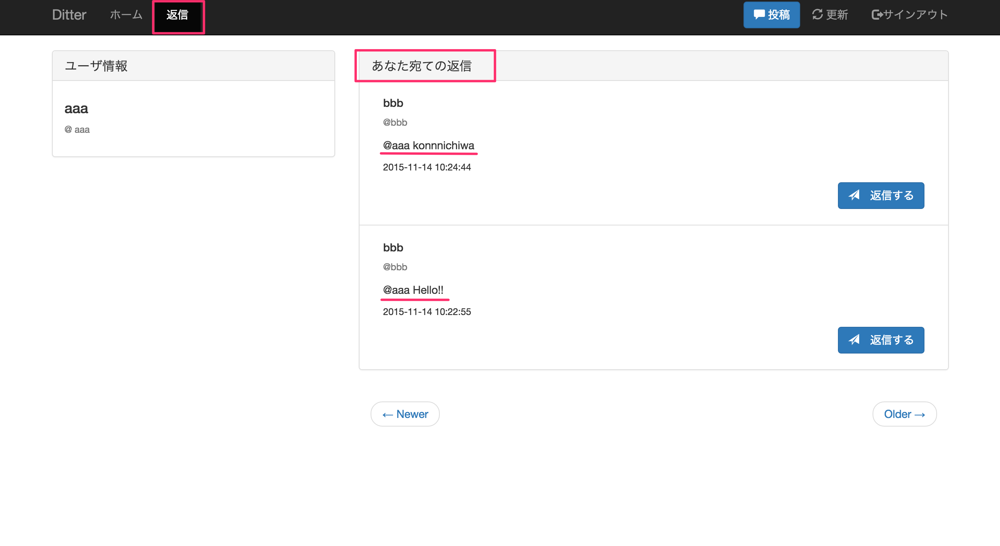

# 返信画面の作成

本稿では、返信画面を作成します。返信画面とは、自分宛の返信の投稿だけをタイムラインに表示させる画面です。

### 完成図


### 要求仕様

**`reply.php`で自分宛ての返信のみのタイムラインを表示させる**

現時点では、投稿には返信先の情報がないので、その投稿がただの投稿か、誰かへの返信のための投稿かどうかの判断が出来ない状態です。そこで、返信の投稿であれば、スクリーン名が投稿の内容に含まれることを利用して、その投稿に返信先の情報（ユーザID）を追加できるようにします。

仕組みは以下の通りです。

1. 投稿の内容に`@スクリーン名`が含まれる場合には返信だとみなす
2. スクリーン名からその返信先ユーザのIDを取得して投稿に情報として持たせる
3. 投稿が持っている返信先のユーザIDが自分のものだけを返信画面のタイムラインに表示させる

### 作成手順
1. 投稿が誰かへの返信だった時、返信先のユーザIDを取得する関数を追加
1. 返信先のユーザIDを保存する関数を追加
1. 自分宛ての返信を取得する関数を追加
1. タイムラインに表示させる

## 1. 投稿が誰かへの返信だった時、返信先のユーザIDを取得する関数を追加

投稿の内容に`@スクリーン名`が含まれるかどうかを調べ、含まれていた場合はその投稿は返信であるとする。

### コード
`functions.php`に追記しましょう。

#### functions.php

```php
// @スクリーン名が含まれていた場合にそのユーザIDを取得する関数
function getReplyId(PDO $pdo, $text)
{
	$at = preg_match_all('/@(?P<screen_name>[a-zA-Z0-9]+) /', $text, $mention);
	if ($at) {
 		// スクリーン名からユーザIDをを返す
    	return getUserIdByScreenName($pdo, $mention["screen_name"][0]);
    }
    // 返信でなければNULLを返す
    return null;
}

// スクリーン名からユーザIDを取得する関数
function getUserIdByScreenName(PDO $pdo, $screenName)
{
    $sql = 'SELECT id FROM users WHERE `screen_name` = :screen_name';
    $statement = $pdo->prepare($sql);
    $statement->bindValue(':screen_name', $screenName, PDO::PARAM_STR);
    $statement->execute();
    if ($row = $statement->fetch(PDO::FETCH_ASSOC)) {
        return $row['id'];
    } else {
        return null;
    }
}
```

### コードの解説

<!-- 
```php
$at = preg_match_all('/@(?P<screen_name>[a-zA-Z0-9]+) /', $text, $mention);
```

`@スクリーン名`が含まれているかどうかを調べるために、正規表現という表現法を使用します。正規表現とは、文字列のパターンを表現する表記法で、文字列の検索・置換を行うときに利用されます。この表現方法を利用すれば、たくさんの文章の中から容易に見つけたい文字列を検索することができます。今回は、上記のコードの`/@(?P<screen_name>[a-zA-Z0-9]+) /`の部分が正規表現の部分です。

#### 正規表現の書き方について

`/正規表現内容/`とすることで、正規表現の始まりと終わりを示します。

[preg\_match\_all](http://php.net/manual/ja/function.preg-match-all.php)という関数は、繰り返し正規表現検索を行うための関数で、

```php
if ($at) {
  //スクリーン名からユーザIDを取得した結果を返す
  return getUserIdByScreenName($pdo, $mention["screen_name"][0]);
}
return null;
```

次に、上記のコードのif文で、もしマッチしていたらスクリーン名からユーザIDを取得する関数である`getUserIdByScreenName()`を呼び出しています。`getUserIdByScreenName()`の中を見てみると、

```php
$sql = 'SELECT id FROM users WHERE `screen_name` = :screen_name';
```
より、スクリーン名で条件付けられた`users`テーブルの`id`を取得していることがわかります。これで、返信先のユーザIDを取得することが出来ました。

## 2. 返信先のユーザIDを保存する関数を追加
1で、投稿が誰かへの返信だった時、返信先のユーザIDを取得する関数を作成しました。そこで、実際に投稿する時にこの関数を呼び出します。方法としては、以前作成した投稿するための関数である`writePost()`を編集し、DBの`posts`テーブルの`in_reply_to_user_id`に返信先のユーザIDを保存できるようにします。
-->

### コード
`functions.php`の`writePost()`を変更しましょう。

#### functions.php

```php
function writePost(PDO $pdo, $id, $text)
{
	// 以下を変更
    $replyUserId = getReplyId($pdo, $text);
    $sql = 'INSERT INTO posts (user_id,in_reply_to_user_id,text) VALUES (:user_id, :reply_user_id, :text)';
    $statement = $pdo->prepare($sql);
    $statement->bindValue(':user_id', $id, PDO::PARAM_INT);
    $statement->bindValue(':reply_user_id', $replyUserId, PDO::PARAM_INT);
    $statement->bindValue(':text', $text, PDO::PARAM_STR);
    $statement->execute();
}
```

### コードの解説

```
$replyUserId = getReplyId($pdo, $text);
```

この行で、1で作った`getReplyIg()`を呼び出しています。この関数は`@スクリーン名`が含まれていた場合にそのユーザIDを取得するための関数でしたね。よって`$replyUserId`には、返信先のユーザIDが入ります。また、もし投稿が返信ではなくただの投稿だった場合は`NULL`が入ります。

```php
...
$sql = 'INSERT INTO posts (user_id,in_reply_to_user_id,text) VALUES (:user_id, :reply_user_id, :text)';

...

$statement->bindValue(':reply_user_id', $replyUserId, PDO::PARAM_INT);

...
```

上記のように`in_reply_to_user_id`カラムに返信先のユーザIDが挿入されるように変更されました。

## 3. 自分宛ての返信を取得する関数を追加

### コード
`functions.php`に以下を追記しましょう。

#### functions.php

```php
// 自分宛ての返信だけを取得する
function getReplyTimeline(PDO $pdo, $userId)
{
  $sql = 'SELECT * FROM posts WHERE `in_reply_to_user_id` = :user_id ORDER BY `created_at` DESC';
  $statement = $pdo->prepare($sql);
  $statement->bindValue(':user_id', $userId, PDO::PARAM_INT);
  $statement->execute();

  if ($rows = $statement->fetchAll(PDO::FETCH_ASSOC)) {
    return $rows;
  } else {
    return false;
  }
}
```

### コードの解説

全ての投稿を取得していた`getTimeline()`と比較してみてください。SQL文の中に`WHERE in_reply_to_user_id = :user_id`が追加されています。

このように、`WHERE 条件式`を追加すると、条件式に一致する行を取得することができるようになります。詳しい説明は[MySQLリファレンス](./../common/mysql.md)を見て下さい。

ここでは、`in_reply_to_user_id`が`uesr_id`のものだけをpostsテーブルから取得するという条件をつけています。もちろんここの`user_id`は自分のユーザIDです。

これで、自分宛ての返信を取得する関数を準備出来ました。あとは、表示させるだけです！


## 4. タイムラインに表示させる
返信画面は`reply.php`です。`index.php`とほぼ同じになるので、`index.php`を`reply.php`にそのままコピペして下さい。その後、少しだけ編集していきます。

### コード
`reply.php`の以下の3点を書き換えましょう。

#### reply.php
```php
<?php
// PHP部分
...

$user_id = $_SESSION['user_id'];
$db = connectDb();

// 以下を変更1
$posts = getReplyTimeline($db, $user_id);
// 変更1ここまで

...

<!-- ここからHTML部分 -->

...
<ul class="nav navbar-nav">
  <!-- 以下を変更2 -->
  <li><a href="./index.php">ホーム</a></li>
  <li class="active"><a href="./reply.php">返信</a></li>
  <!-- 変更2ここまで -->
</ul>
...

<!-- 全員の投稿表示領域の見出しの部分 -->
<div class="panel-heading">
  <!-- 以下を変更3 -->
  <h3 class="panel-title">あなた宛ての返信</h3>
  <!-- 変更3ここまで -->
</div>
```

### コードの解説

```php
$posts = getReplyTimeline($db, $user_id);
```

`$post`には3で作成した`getReplyTimeline()`の返り値である自分宛ての返信のみが入ります。あとは、[投稿一覧表示の作成](https://github.com/dit-rohm/textbook/blob/master/autumn/timeline/timeline.md)と同じです。

```html
<li><a href="./index.php">ホーム</a></li>
<li class="active"><a href="./reply.php">返信</a></li>
```
`class="active"`をつけることで、返信ボタンをアクティブにすることが出来ます。

***

以上で返信画面の作成は終わりです！ここまでで、Ditterの最低限の部分の実装は終わりました！お疲れ様です！！

これから先は、もっと細かい部分へと入ります。

### 今回使った構文や関数
- [preg\_match\_all](http://php.net/manual/ja/function.preg-match-all.php)

### 参考
- [MySQLリファレンス](./../common/mysql.md)
