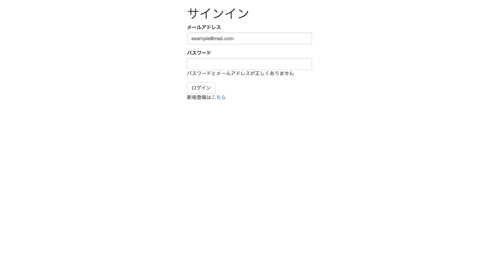

# サインイン機能

前の章「新規登録機能の作成」でユーザの登録ができたかと思いますが、この章ではそのユーザ情報を使ってサインイン（ログイン）する機能を作っていきます。

主な流れとしては、

1. サインインフォームの作成（HTML）
1. セッションIDの発行（PHP, MySQL）
1. リダイレクト（PHP）

となっています。この時点では分からない用語がたくさんあるかと思いますが、それぞれの節で説明します。

## 1. サインインフォームの作成

サインアップ（登録）フォームと同じように、フォームから必要なデータを送信して、サインインの処理を行います。

送信するデータはメールアドレスとパスワードの2つです。この2つの情報からユーザの認証を行います。

以下がフォーム部分のHTML部分です。

- signin.php

```html
<!DOCTYPE html>
<html lang="ja">
<head>
  <meta charset="utf-8">
  <meta name="viewport" content="width=device-width, initial-scale=1">
  <title>signin - Ditter</title>
  <link rel="stylesheet" href="https://maxcdn.bootstrapcdn.com/bootstrap/3.3.5/css/bootstrap.min.css">
</head>
<body>
  <div id="main" class="container">
    <div class="row">
      <div class="col-md-4 col-md-push-4">
        <h1>サインイン</h1>
        <form action="signin.php" method="POST">
          <div class="form-group">
            <label for="InputEmail">メールアドレス</label>
            <input type="email" class="form-control" id="inputEmail" name="email" value="">
          </div>
          <div class="form-group">
            <label for="InputPassword1">パスワード</label>
            <input type="password" class="form-control" id="inputPassword" name="password">
          </div>
          <input type="hidden" name="token" value="">
          <button type="submit" class="btn btn-default">サインイン</button>
        </form>  
        <p>新規登録は<a href="./signup.php">こちら</a></p>
      </div>
    </div>
  </div>
<script src="https://ajax.googleapis.com/ajax/libs/jquery/1.11.3/jquery.min.js"></script>
<script src="https://maxcdn.bootstrapcdn.com/bootstrap/3.3.5/js/bootstrap.min.js"></script>
</body>
</html>
```

ページは以下のようになります。


### HTMLの解説

以下は上記HTMLの解説ですので、再度入力する必要はありません。

#### メイン部分のカラム

```html
<div id="main" class="container">
  <div class="row">
    <div class="col-md-4 col-md-push-4">
      <!-- この部分にフォームが入っています -->
    </div>
  </div>
</div>
```

Bootstrapのメイン機能の一つ、カラムを利用しています。サイズ4のカラムを作り、4つ右へずらすことでフォームを配置します。

`col-md-4`なのでブラウザの表示領域が992px以上の時にこの設定が効き、992px未満だと幅いっぱいで表示されます。

#### 見出し

```html
<h1>サインイン</h1>
```

ここは大丈夫ですね。ただの見出しです。

#### フォーム

```html
<form action="signin.php" method="POST">
  <div class="form-group">
    <label for="InputEmail">メールアドレス</label>
    <input type="email" class="form-control" id="inputEmail" name="email" value="">
  </div>
  <div class="form-group">
    <label for="InputPassword1">パスワード</label>
    <input type="password" class="form-control" id="inputPassword" name="password">
  </div>
  <button type="submit" class="btn btn-default">サインイン</button>
</form>
```

フォームの`action="signin.php"`となっていますので、データはこのファイル`signin.php`に送信されます。

また、`method="POST"`となっていますので、POSTメソッドでWebサーバに送信されます。

フォームの送信方法にはPOSTとGETがあることは「はじめてのPHP」で説明があったと思いますが、両者の違いが気になる方はお近くのメンターか、Google先生に聞いてみてください。

各フォーム部品については、Bootstrapを利用しているため、必要なクラス等が付いています。

[Bootstrapのドキュメント](http://getbootstrap.com/css/#forms)を参考にしてください。

## 2. セッションについて

セッションという仕組みを利用して、次章以降に向けてユーザの識別ができるようにします。

### セッションとは？

簡単に言うと、ページが変わっても同じ変数を使えるようにするための仕組みのことです。セッション変数はサーバ上で保存することができます。

Ditterではこの仕組を利用して、ログインしているユーザにセッションIDを発行することでユーザを識別し、個々に合わせて異なる処理を行うことが可能となります。

`session_start()`を記述することでセッションを利用できます。セッションはどのページ表示を行うファイルでも利用しますので、`init.php`に含めます。

### セッションを設定するコード

- init.php

```php
<?php
require_once 'config.php';
require_once 'functions.php';
// 以下を追記
session_start();
```

- signin.php

```php
<?php
require_once 'init.php';

if ($_SERVER['REQUEST_METHOD'] == 'POST') {
  $error = '';
  $email = $_POST['email'];
  $password = $_POST['password'];
  $db = connectDb();

  if (!$user_id = getUserId($email, $password, $db)) {
    $error = 'パスワードとメールアドレスが正しくありません';    
  } else if (empty($error)) {
    session_regenerate_id(true);
    $_SESSION['user_id'] = $user_id;
  }
}

?>
<!-- 以下は先に記述済み -->
<!DOCTYPE html>
...
...
```
- signin.php （HTMLの部分）

`<form>...</form>`にエラーメッセージの表示領域を追加します。

```html
...
...
<form action="signin.php" method="POST">
  <div class="form-group">
    <label for="InputEmail">メールアドレス</label>
    <!-- この<input>を書き換え -->
    <input type="email" class="form-control" id="inputEmail" name="email" value="<?php if (isset($email)) print escape($email); ?>">
  </div>
  <div class="form-group">
    <label for="exampleInputPassword1">パスワード</label>
    <input type="password" class="form-control" id="inputPassword" name="password">
    <!-- エラーメッセージを表示する段落<p>を追記 -->
    <p><?php if (isset($error)) { print escape($error); }?></p>
  </div>
  <button type="submit" class="btn btn-default">ログイン</button>
</form>
...
...
```

- functions.php

これまでに書いた関数の下に書き足してください。

```php
...
...
function getUserId($email, $password, $db) {
  $sql = "SELECT id, password FROM users WHERE email = :email";
  $statement = $db->prepare($sql);
  $statement->bindValue(':email', $email, PDO::PARAM_STR);
  $statement->execute();
  $row = $statement->fetch();
  if (password_verify($password, $row['password'])) {
    return $row['id'];
  } else {
    return false;
  }
}

function escape($s) {
  return htmlspecialchars($s, ENT_QUOTES, "UTF-8");
}
```

この時点で誤ったメールアドレスとパスワードの組み合わせを入力すると、以下のようにエラーメッセージが出力されます。



### コードの解説

#### HTTPリクエストの判定

`if ($_SERVER['REQUEST_METHOD'] == 'POST')`でサーバへのHTTPリクエストを判定しています。POSTであればログインの処理を開始します。

#### getUserId 関数

メールアドレスとパスワードからユーザのIDを取得するための関数です。

```php
function getUserId($email, $password, $db) {
  $sql = "SELECT id, password FROM users WHERE email = :email";
  $statement = $db->prepare($sql);
  $statement->bindValue(':email', $email, PDO::PARAM_STR);
  $statement->execute();
  $row = $statement->fetch();
  if (password_verify($password, $row['password'])) {
    return $row['id'];
  } else {
    return false;
  }
}
```

引数は「フォームから送信されたメールアドレス」「フォームから送信されたパスワード」「データベースのオブジェクト（PDO）」です。

データベースを操作しているのは以下の記述です。

```php
$sql = "SELECT id, password FROM users WHERE email = :email";
$statement = $db->prepare($sql);
$statement->bindValue(':email', $email, PDO::PARAM_STR);
$statement->execute();
$row = $statement->fetch();
```

SQL文（`$sql`）は **「フォームから送信されたメールアドレスと一致するemailをusersテーブルで検索し、一致した行のidとpasswordを取得」** といった指示です。

結果（データベースから得たパスワードとID）は`$row[]`という連想配列に代入されます。

上記のSQL文で得たパスワードと、フォームから送信されたパスワードとが一致するかは以下のコードで確認しています。

```php
if (password_verify($password, $row['password'])) {
    return $row['id'];
} else {
  return false;
}
```

`passqord_verify(フォームから送信されたパスワード, データベースから取得したパスワード)`でパスワードの照合ができます。

一致したら`$row['id']`に入れておいたユーザIDを返し、不一致であれば`false`を返します。

#### セッションIDの発行

新たなセッションとして、データベースから取得した`$user_id`を利用します。連想配列`$_SESSION`に代入するだけです。

#### HTML部分

エラーが有った場合、ユーザにそれを知らせないシステムは不親切ですよね？

一般的なサインインフォームと同様に、ユーザ認証に失敗すると

1. エラーメッセージを表示
1. メールアドレスを補完入力

しておく処理を書きます。

```html
<input type="email" class="form-control" id="inputEmail" name="email" value="<?php if (isset($email)) print escape($email); ?>">

<p><?php if (isset($error)) { print escape($error); }?></p>
```

`<input>`タグの`value`属性に値を入れておくことで、フォームの中に予め入力されている状態を作ります。

変数`$email`に値があれば、その値でフォームを埋めます。

また、変数`$error`に値が存在するかを確認しています。値があればその値、つまりエラーメッセージを出力します。

なお、ユーザからの入力をHTMLで出力する際には必ずエスケープという処理を行います。

今回はescape関数を作ってエスケープ処理を書きました。

```php
function escape($s) {
  return htmlspecialchars($s, ENT_QUOTES, "UTF-8");
}
```

`htmlspecialchars()`という関数は引数の文字列に対してエスケープ処理を行います。

エスケープ処理とは、マークアップ言語（HTML）やプログラミング言語で文字列を扱うときに、特別な意味を持つ記号を別の文字に置き換えて無効化するという処理です。

例えばHTMLにおいて、"&lt;"という文字はタグの開始を意味します。この記号を"&amp;lt;"に置き換えることで、「タグの開始」という意味を無効化しています。

これを怠ると、フォームからHTMLタグを送信され、その結果ウェブサイトの改ざんを許してしまったりします。

詳しくは「XSS（クロスサイトスクリプティング）」で調べてみてください。

## 3. リダイレクト

さて、最後の節です。ユーザがサインインしたら別のページヘ飛ばさなければ不親切ですよね？また、既にサインイン済みのユーザがこのページにアクセスするのは全くの無駄です。

リダイレクトは`header("Location: {URL}");`と書くことで実現できます。

### リダイレクトのコード

- function.php

これまでのコードの下に追記してください。

```php
...
function isSignin()
{
    if (!isset($_SESSION['user_id'])) {
        // 変数に値がセットされていない場合
        return false;
    } else {
        return true;
    }
}
```

- signin.php

```php
<?php
require_once 'init.php';

// true だったらサインインしているので index.php へ飛ばす
if (isSignin()) {
    $index_url = 'index.php';
    header("Location: {$index_url}");
    exit;
}

...
...
  // この if 文はすでに書いていますので、 else if の処理を付け足してください。
  if (!$user_id = getUserId($email, $password, $db)) {
    $error = 'パスワードとメールアドレスが正しくありません';
  } else if (empty($error)) {
    // エラーが無ければセッションIDを発行して index.php へ飛ばす
    session_regenerate_id(true);
    $_SESSION['user_id'] = $user_id;
    $index_url = "index.php";
    header("Location: {$index_url}");
    exit;
  }
...
...
```

インデックスページでユーザIDが正常に取得できているか確認するため、以下のコードも書いておきましょう。

インデックスページでユーザIDが表示されます。

- index.php

```php
<?php
require_once 'init.php';

echo "<pre>";
print_r($_SESSION);
echo "</pre>";
```

上記は確認用のコードなので、確認が終わったら削除しておいてください。

以上で`signin.php`の編集は終了です。かなり長い章でしたが、お疲れ様でした。
