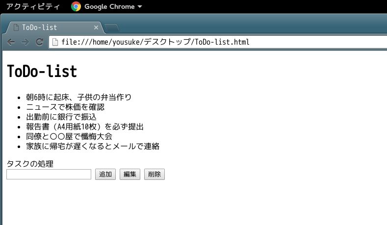

# 次への一歩

秋学期の勉強会では『Ditter』の作成をすることで、
バックエンドについての勉強をしました。
アカウントの新規登録やサインイン、サインアウト、
そして一番重要な機能である投稿＆返信機能を実装しました。
新しいことを学んだと思うので、
ここで知識の整理をしましょう！

## 1.データの送受信

まずは秋学期から学び始めたことについて要点をまとめます。
『Ditter』において様々なデータの送受信を行いましたが、
その範囲で登場した **POST** 通信と **GET** 通信の特徴を以下にまとめます。

### POST

1. Body部分（form）に含まれるため、取得が少し面倒（クエリパラメータをURLに含ませることができず、HTMLからPOSTする場合にはフォームを書く必要があります）

### GET

1. HTTP情報に含まれるため、取得が簡単
1. テキストデータのみ送信可能
1. データをリクエストURLの後に付与して送信する
1. URLの後に付与することで、データ量（文字数）に制限がかかってしまう
1. URLの後に付与することで、他人に入力したデータが丸見えになってしまう

### POSTとGETの使い分け

上記で **POST** と **GET** の二つの送信方法についての特徴を述べましたが、
結局どういう時にどっちを使えばいいの？
となった場合の使い分けを紹介します。  
基本は **GET** 送信で構わないのですが、
以下の3つの場合では **POST** 送信を用いることで使い分けることをオススメします。

1. サーバでデータ更新をする場合（容易に書き換え可能なため）
1. データ量が多い場合
1. 秘匿情報を送る場合（GET送信を用いるとURLの後に入力データが漏洩してしまう）

『Ditter』では、
[サイン機能の作成](https://github.com/dit-rohm/textbook/blob/master/autumn/signin/signin.md#2-セッションについて)
の際にPOST送信を用いました。
セッションIDを発行することで、
ユーザの識別をできるようにしましたね。
この際に他人に見られてはいけない
メールアドレスやパスワードを送信するので、
POST送信を用いることでGET送信と使い分けています！

## 2.データベース(DB)

『Ditter』では、
アカウント情報や投稿内容の保存などの値を保存するためにデータベースを用いました。
ではデータベースやテーブルの作成方法を復習しましょう。
SQLについての文法がまとまったリファレンスを載せておくので、
復習を兼ねてもう一度目を通しておきましょう！

[MySQLリファレンス](https://github.com/dit-rohm/textbook/blob/master/common/mysql.md)

### 作成

#### 1.データベース

まずはphpMyAdminのページにアクセスしましょう！

[phpMyAdmin](http://localhost/phpmyadmin)  

  

それから上のタブのデータベースをクリックし、
 **データベースを作成する** というところを押すと、
 データべースを作成できましたよね！

#### 2.テーブル

先程のタブから **SQL** をクリックして、
以下のようにSQL文を打ち込めばテーブルが完成します！

`CREATE TABLE テーブル名 (列名1 型1[, 列名2 型2, ...]);`

『Ditter』では
[新規登録機能の作成](https://github.com/dit-rohm/textbook/blob/master/autumn/signup/signup.md#3-データベースの処理の部分)
でユーザの情報を保存するuserテーブルを作成し、
[投稿一覧の表示](https://github.com/dit-rohm/textbook/blob/master/autumn/timeline/timeline.md#2-投稿を保存するテーブルの作成)
で投稿の情報を保存するpostsテーブルを作成しましたね！

### SELECT文

『Ditter』では
[サイン機能の作成](https://github.com/dit-rohm/textbook/blob/master/autumn/signin/signin.md#2-セッションについて)
の際にSELECT文を用いました。SELECT文とは1つ以上のテーブルから選択された行を取得する命令です。構文は以下のような形式です！

`SELECT 列名1[, 列名2, ...] FROM テーブル名;`

ここまでで述べた作成方法は以前にテキストで学習した範囲なので、
忘れていた方は復習しておきましょう！

[（新規登録機能の作成）](https://github.com/dit-rohm/textbook/blob/master/autumn/signup/signup.md#1-データベースの作成phpmyadmin)

以上が『Ditter』で使用した機能のまとめです。
データの送受信やDBの作成をきちんとおさえれたでしょうか？
この機会にしっかり復習しましょう！

## 3.ToDoリスト

では『Ditter』が一段落付いたところで、
『Ditter』の知識を整理して自分のものとするためにも、
今度は自分の力のみで簡単なWebアプリケーションの作成をしてもらいます！  
今回は大学生活に欠かせない『ToDoリスト』を作りましょう！

#### 機能の概要

1. タスクの追加
1. タスクの文章を編集
1. タスクを削除

#### イメージ

  

あくまでイメージです！
とりあえずCSSなどのデザインの装飾は不要なので、
HTMLだけの質素な『ToDoリスト』を作成しましょう!
余裕があれば、
オリジナル要素として【期限】などの項目を増やして、
リストの内容を忘れないように工夫をすることなどもいいかもしれないですね！:smile:

##### 4.参考文献

[GETとPOSTの違い](http://scene-live.com/page.php?page=27)
