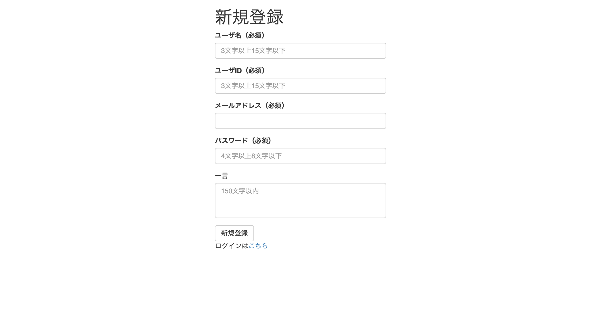

# 新規登録機能の作成

以下の流れに沿って新規登録機能の作成をしていきます。

1. 見た目部分（HTML）
1. データを受け取る部分（PHP）
1. データベースの処理の部分（PHP）  

作成する画面は以下の画像になります。



## 1. 見た目部分（HTML）

まずは、HTMLの部分から書いていきます。`signup.php`の`<body>`の中身を追記して下さい。HTMLの書き方でわからない部分があれば、<a href="" target="_blank">HTMLリファレンス</a>を読むか、メンターに質問して下さい。

#### signup.php

```html 
<!DOCTYPE html>
<html lang="ja">
<head>
  <meta charset="utf-8">
  <meta name="viewport" content="width=device-width, initial-scale=1">
  <title>signup - Ditter</title>
  <link rel="stylesheet" href="https://maxcdn.bootstrapcdn.com/bootstrap/3.3.5/css/bootstrap.min.css">
</head>
<body>
  <div id="main" class="container">
    <div class="row">
      <div class="col-md-4"></div>
      <div class="col-md-4">
        <h1>新規登録</h1>
        <!-- フォーム部分 -->
        <form action="" method="POST">
          <!-- ユーザ名 -->
          <div class="form-group">
            <label for="userName">ユーザ名（必須）</label>
            <input type="text" class="form-control" id="userName" name="user_name" placeholder="3文字以上15文字以下" />
          </div>
          <!-- ユーザID -->
          <div class="form-group">
            <label for="screenName">ユーザID（必須）</label>
            <input type="text" class="form-control" id="screenName" name="screen_name" placeholder="3文字以上15文字以下" />
          </div>
          <!-- メールアドレス -->
          <div class="form-group">
            <label for="email">メールアドレス（必須）</label>
            <input type="email" class="form-control" id="email" name="email" />

          </div>
          <!-- パスワード -->
          <div class="form-group">
            <label for="password">パスワード（必須）</label>
            <input type="password" class="form-control" id="password" name="password" placeholder="4文字以上8文字以下" />
          </div>
          <!-- 一言 -->
          <div class="form-group">
            <label for="comment">一言</label>
            <textarea class="form-control" id="comment" name="comment" placeholder="140文字以内" rows="3" style="resize:none"></textarea>
          </div>
          <!-- 新規登録ボタン -->
          <button type="submit" class="btn btn-default">新規登録</button>
        </form>  
        <!-- ログイン画面へのリンク -->
        <p>ログインは<a href="./signin.php">こちら</a></p>
      </div>
      <div class="col-md-4"></div>
    </div>
  </div>
<script src="https://ajax.googleapis.com/ajax/libs/jquery/1.11.3/jquery.min.js"></script>
<script src="https://maxcdn.bootstrapcdn.com/bootstrap/3.3.5/js/bootstrap.min.js"></script>
</body>
</html>
```

### HTMLの説明

新規登録画面では **ユーザ名**、 **ユーザID**、 **メールアドレス**、 **パスワード**、 **一言**、の5つの項目を登録してもらうためのフォームを用意しました。以下の部分に注目して下さい。

>  引用
>
> ```php
<form action="" method="POST">
	<div class="form-group">
		<label for="userName">ユーザ名</label>
    	<input type="text" class="form-control" id="userName" name="user_name" placeholder="3文字以上15文字以下" />
	</div>
</form>
```

HTMLでフォームを作成するには、まず、

> 引用
> 
> ```php
<form action="" method="POST"> ... </form>
```

のように正式にフォームを用意します。ここで、action属性は、フォームから収集したデータが送られるべき場所(URL)を定義し、method属性は、データを送る際のHTTPメソッド("get"または"post")を定義します。今回はpostを使用します。次に、`<form>`の中に`<input>`や`<textarea>`を追加します。type属性によって`<input>`要素の動作を定義することが出来ます。例えば、以下はテキストを入力するフォームです。

> 引用
>
> ```php
<input type="text" placeholder="3文字以上15文字以下" />
```

`type="text"`とすることで単一行のテキストフィールドを定義することができます。placeholder属性に値を指定しておくと、初期表示する内容を指定することが出来ます。classについてはBootstrapを使用するためにつけていますので、<a href="http://getbootstrap.com/css/#forms" target="_blank">参考文献1</a>を読んで下さい。

また、`<label>`を使うと、フォームの構成部品を項目名を関連付けることが出来ます。for属性の値と、フォーム部品のid属性の値を同じものにすることで関連付けられ、ラベルをクリックすると対応するフォーム部品がアクティブになります。

> 引用
>
> ```php
<label for="userName">ユーザ名</label>
```

フォームについてより詳しく知りたい人は、<a href="https://developer.mozilla.org/ja/docs/Web/Guide/HTML/Forms/My_first_HTML_form" target="_blank">参考文献2</a>を読んでみて下さい。

それでは、<a href="http://localhost/ditter/signup.php" target="_blank">http://localhost/ditter/signup.php</a>にアクセスしてみて下さい。最初に提示した作成する画面と同じものが見れれば成功です！今は、新規登録ボタンを押しても何も変わりません。

## 2. データを受け取る部分（PHP）
  
それでは次に、フォームから値が送信されてきた時の動作を書いていきましょう。ここからはPHPになります。引き続き、`signup.php`を編集していきます。`signup.php`には、既に先ほどのHTML部分が書かれているかとは思いますが、そのまま上部に追記して下さい。

#### signup.php

```php
<?php

if ($_SERVER['REQUEST_METHOD'] === 'POST') {
	if ((isset($_POST['user_name']) || $_POST['user_name'] !== '') && (isset($_POST['screen_name']) || $_POST['screen_name'] !== '') && (isset($_POST['email']) || $_POST['email'] !== '') && (isset($POST['password']) || $_POST['password'] !== '')) {
  
		// 送信された値を変数に代入
		$user_name = $_POST['user_name'];
		$screen_name = $_POST['screen_name'];
		$email = $_POST['email'];
		$password = $_POST['password'];
		$comment = $_POST['comment'];
		
	} else {
 		print "値が入力されていません";
	}
}
```

まず、以下の行でPOSTのリクエストが来たかどうかのチェックをします。POSTではない場合は今回は何もしません。

> 引用
>
>```php
if ($_SERVER['REQUEST_METHOD'] === 'POST') { ... }
```

フォームには、 **ユーザ名**、 **ユーザID**、 **メールアドレス**、 **パスワード**、 **一言**、の5つの項目があったので、`$user_name`、`$screen_name`、`$email`、`$password`、`$comment`という変数を用意します。ユーザIDは`$screen_name`としていますので注意して下さい。以下の行で、値されているか、または入力されているかのチェックをしています。

> 引用
>
>```php
if ((isset($_POST['user_name']) || $_POST['user_name'] !== '') && ...) { ... }
```

`$_POST['comment']`だけはNULLを許すので、それ以外について全てチェックします。

そして、値の入力がされていたらPOSTで送られてきた値を変数に代入します。その値は`$_POST['']`とすることで取得でき、`''`の中には、name属性が入ります。例えばユーザ名だったら

> 引用
>
> ```php
<input type="text" class="form-control" id="userName" name="user_name" placeholder="3文字以上15文字以下" />
```

上記のようなフォームがあり、この`name="user_name"`の部分が`$_POST['user_name']`のように使われます。以下の部分で値を代入しています。

> 引用
>
> ```php
// 送信された値を変数に代入
$user_name = $_POST['user_name'];
$screen_name = $_POST['screen_name'];
$email = $_POST['email'];
$password = $_POST['password'];
$comment = $_POST['comment'];
```

値が入力されていない場合は、"値が入力されていません"と表示させます。一度<a href="http://localhost/ditter/signup.php" target="_blank">http://localhost/ditter/signup.php</a>にアクセスしてみて確認してみると良いでしょう。


## 3. データベースの処理の部分（PHP）

最後に、データベースに値を保存します。ここで、データベースの作成から保存までを以下の順に沿ってやっていきます。

1. データベースの作成（phpMyAdmin）
1. usersテーブルの作成（phpMyAdmin）
1. PHPでデータベースに接続する準備（PHP）
1. 値の挿入（PHP）

### 1. データベースの作成（phpMyAdmin）

今回は、`ditter`という名前のデータベースを作成します。<a href="http://localhost/phpmyadmin" target="_blank">http://localhost/phpmyadmin</a>にアクセスして下さい。

上のタブのデータベースをクリックし、**データベースを作成する**というところから`ditter`という名前で作成して下さい。テーブルを作成する画面に切り替わればOKです。

### 2. usersテーブルの作成（phpMyAdmin）

新規登録やログインをするには、ユーザの情報を保存する必要があります。そのために、`users`というテーブルを用意し、情報を保存していきましょう。

上部にあるタブから **SQL**をクリックし、以下のSQL文を貼り付け、実行ボタンを押して下さい。

```sql
CREATE TABLE `users` (
`id` INT UNSIGNED NOT NULL AUTO_INCREMENT,
`screen_name` VARCHAR(15) NOT NULL UNIQUE,
`user_name` NVARCHAR(15) NOT NULL,
`email` VARCHAR(255) NOT NULL UNIQUE,
`password` VARCHAR(255) NOT NULL,
`comment` NVARCHAR(255),
`created_at` DATETIME NOT NULL DEFAULT CURRENT_TIMESTAMP,
`updated_at` DATETIME NOT NULL DEFAULT CURRENT_TIMESTAMP ON UPDATE CURRENT_TIMESTAMP,
PRIMARY KEY (`id`)
);
```

usersテーブルには、8つのカラムがあり、それぞれの内容は以下のようになっています。

* **id** - ユーザごとに独自のIDを自動でふっておく。
* **screen_name** - ユーザIDを保存、15文字以内、必須、一意。 
* **user_name** - ユーザ名を保存、15文字以内、必須。
* **email** - メールアドレスを保存、必須、一意,
* **password** - パスワードを保存、必須,
* **comment** - 一言コメントを保存,
* **created_at** - 作成された日時を保存、デフォルトで現在時刻が入る,
* **updated_at** - 変更があった日時を保存

より詳しくは、<a href="./../reference/mysql.md" target="_blank">MySQLリファレンス</a>を見て下さい。これで、テーブルの作成ができました。上部タブの **構造**をクリックして見ると、きちんと作成していることがわかります。それでは、PHPでデータベースに接続する処理を書いていきます！

### 3. PHPでデータベースに接続する準備

PHPでデータベースに接続する際に、今回は **PDOクラス**を使用します。動作が速い、プリペアドステートメントで名前付きプレースホルダが使える、エラーを例外としてスローさせることが出来るなどのメリットがあります。

`functions.php`に、データベースに接続処理を関数として書いておきましょう。

#### functions.php

```php
function connectDb() {
  try {
    return new PDO(DSN, DB_USER, DB_PASSWORD);
  } catch (PDOException $e) {
    print $e->getMessage();
    exit;
  }
}
```

ここで、<a href="http://php.net/manual/ja/pdo.construct.php" target="_blank">PDO::__construct</a>メソッドを使用してインスタンスを生成しています。DSN（Data Source Name）にはデータベースに接続するために必要な情報（MySQL、データベース名、ホスト、文字セット）を、DB_USERにはユーザー名、DB_PASSWORDにはパウワードが入ります。それぞれ、`config.php`に定数として以下のように定義しておきます。

#### config.php

```php
<?php

define('DSN', 'mysql:dbname=ditter;host=localhost;charset=utf8');
define('DB_USER', 'root');
define('DB_PASSWORD', 'rootのパスワード');
```

これらの`config.php`と`functions.php`を`signup.php`から読み込むことで、ここで定義した定数や関数を使用することが出来ます。`signup.php`の`<?php`のすぐ下の行に以下を追記して下さい。これで`functions.php`と`signup.php`を読み込むことができます。

#### signup.php

```php
<?php
require_once('config.php');
require_once('functions.php');
```

ここまでで接続準備は終わりです。

### 4. 値の挿入（PHP）

それでは、データベースへの値の挿入部分を書いていきます。以下を2章で書いた変数の宣言の下の行から追記して下さい。

#### signup.php

```php
...
$comment = $_POST['comment'];


//ここから下を追記

// 接続関数を変数に代入
$db = connectDb();

$hash = password_hash($password, PASSWORD_DEFAULT);

$sql = 'INSERT INTO users (screen_name, user_name, email, password, comment) VALUES (:screen_name, :user_name, :email, :password, :comment)';

$statement = $db->prepare($sql);

$statement->bindValue(':screen_name', $screen_name, PDO::PARAM_STR);
$statement->bindValue(':user_name', $user_name, PDO::PARAM_STR);
$statement->bindValue(':email', $email, PDO::PARAM_STR);
$statement->bindValue(':password', $hash, PDO::PARAM_STR);
$statement->bindValue(':comment', $comment, PDO::PARAM_STR);

if($statement->execute()) {
  $signin_url = "signin.php";
  header("Location: {$signin_url}");
  exit;
} else {
  print "データベースへの挿入に失敗しました";
}
```

パスワードはそのままデータベースに保存してしまうとセキュリティ面で問題があるので、以下のようにパスワードハッシュを作り、`$hash`に代入しておきます。

> 引用
>
>```php
$hash = password_hash($password, PASSWORD_DEFAULT);
```

ここからデータベースのやりとりをしていきましょう。

まず、以下のように、SQL文を用意します。受け取った値をデータベースにINSERTするためのSQL文です。

> 引用
>
>```php
$sql = 'INSERT INTO users (screen_name, user_name, email, password, comment) VALUES (:screen_name, :user_name, :email, :password, :comment)';
```

次に、

> 引用
>
>```php
$statement = $db->prepare($sql);
```

この行でSQLを準備します。`users (screen_name, user_name, ...)`のそれぞれに対して`VALUES (:screen_name, :user_name, ...)`のように`:screen_name` や`:user_name`というパラメータを与えています。

次に、

> 引用
> 
> ```php
$statement->bindValue(':screen_name', $screen_name, PDO::PARAM_STR);
$statement->bindValue(':user_name', $user_name, PDO::PARAM_STR);
$statement->bindValue(':email', $email, PDO::PARAM_STR);
$statement->bindValue(':password', $hash, PDO::PARAM_STR);
$statement->bindValue(':comment', $comment, PDO::PARAM_STR);
```

これらの行では、先ほどのパラメータに値を入れています。`bindValue`の1つめにパラメータを指定、2つめにパラメータに入れる変数を指定、3つめに型を指定します。`PDO::PARAM_STR`は文字列であることを意味します。

最後に、

> 引用
> 
> ```php
$statement->execute()
```

で実行できます。今回はエラーがあれば表示、なければ`signin.php`に飛ばすようにしています。

これででデータベース処理ができました。<a href="http://localhost/ditter/signup.php" target="_blank">http://localhost/ditter/signup.php</a>から、新規登録をしてみてください。正しく登録できれば、`signin.php`に飛ぶはずです。また、<a href="http://localhost/phpmyadmin/" target="_blank">phpMyAdmin</a>の`ditter`のusersテーブルに登録した値が入っていると思います。

***

以上で新規登録機能は終わりです。お疲れ様でした！わからなかったところがあれば、自分で調べてみたり、メンターに質問して下さいね！


## 参考文献
1. <a href="http://getbootstrap.com/css/#forms" target="_blank">CSS・Bootstrap#forms</a>
2. <a href="https://developer.mozilla.org/ja/docs/Web/Guide/HTML/Forms/My_first_HTML_form" target="_blank">初めての HTML フォーム</a>
