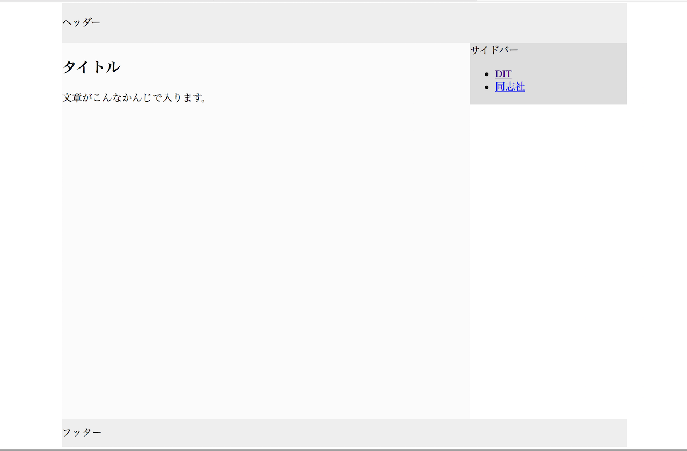

# ブログ風のレイアウト

## サイトの構成

次のスクリーンショットをみてください。



これはブログを想定したWebサイトの例です。
上記の図のように複数の部分に分けられます。
その代表的なものは以下の通りです。

* ヘッダー: ブログの名前やロゴマークなどが入ります。HTMLの ```<head>``` タグとは異なるものです。
* サイドバー: 記事のカテゴリ一覧などが入ります。左側に置かれることもあります。
* コンテンツ: 記事そのものが入ります。
* フッター: 著作権表示や管理者の連絡先などが入ります。

## HTMLを書く

サイトの構造をHTMLに置き換えたものが次のHTMLのコードになります。
骨組みだけを書いておきますので中身は考えて書いてみてください。

```html:index.html
<!DOCTYPE html>
<html lang="ja">
<head>
  <meta charset="utf-8">
  <title>タイトル</title>
</head>
<body>
  <div class="wrapper">
    <!-- この部分のHTMLは書いてください -->
  </div>
</body>
</html>
```

上記の ```wrapper``` は「サイトを包むもの」という意味です。
```margin: auto``` で中央揃えにするために必要となります。
```margin: auto``` に関しては下記の補足にあります。
なお、後に必要となる各 ```<div>``` のclassはここで指定しておきます。 

* ヘッダー: ```class="header"```
* サイドバー: ```class="sidebar"```  
* コンテンツ: ```class="main"```  
* フッター: ```class="footer"```

ここまで完成させてブラウザで確認しても、想定の配置にはなりません。
CSSでレイアウトを指定していないからです、次にその指定を行います。

## CSSを使用してレイアウトを指定しよう

上のスクリーンショットと同様のレイアウトになるようにCSSを書いていきましょう。
まず、HTMLの ```<head> </head>``` に ```<link>``` タグを追加して外部のCSSファイルを読み込めるようにするか、```<head> </head>``` に ```<style> </style>``` タグを追加してCSSを直接記述できるようにしましょう。

以下に記すCSSは未完成です。
続きは考えて書いてみてください。
ブラウザで確認をしながら記述すると良いでしょう。
上のスクリーンショットにおける各要素の厳密な大きさと色を以下に記します。

* ヘッダー
    * padding: 20px
    * 背景色: #eee
* サイドバー
    * 横幅: 250px
    * 高さ: 600px
    * 背景色: #ddd
* メインの部分
    * 横幅: 650px
    * 高さ: 600px
    * 背景色: #fbfbfb
* フッター:
    * padding: 10px
    * 背景色: #eee  

### 外部のCSSファイルを読み込む場合

```html:index.html
<head>
  ...
  <link rel="stylesheet" href="CSSファイルへのパス">
  ...
</head>
```

```css:style.css
.wrapper {
  width: 900px;
  margin: 0 auto;
}

/* 続きはここから */

```

### CSSを直接記述する場合

```html:index.html
<head>
  ...
  <style>
  .wrapper {
    width: 900px;
    margin: 0 auto;
  }
  
  /* 続きはここから */

  </style>
  ...
</head>
```

### 補足説明

#### margin: 0 auto について

幅が指定された ```<div>``` に対して ```margin: 0 auto``` と書くと、上下の ```margin``` を0、左右の ```margin``` を均等な値にするように指定できます。
こうすることによって、幅の指定された ```<div>``` の位置を中央揃えにすることができます。

#### float と clear について

スクリーンショットではサイトバーがコンテンツの右側に回り込んでいます。
本来、 ```<div>``` は下へ下へと追加されていきますが、 ```float``` を使うことで横に回り込ませることができます。

* ```float: left```
指定した ```<div>``` を左詰めにして、次の ```<div>``` をその右側に回り込ませることができます。
* ```float: right```  
指定した ```<div>``` を右詰めにして、次の ```<div>``` をその左側に回り込ませることができます。 

また、上記の回り込みを防ぎたい場合は回り込んでほしくない ```<div>``` に ```clear``` を指定します。
```clear``` にもいくつかの指定の仕方があります。

* ```clear: left```  
```float: left``` を指定した ```<div>``` に対する回り込みを無効化します。
* ```clear: right```  
```float: right``` を指定した ```<div>``` に対する回り込みを無効化します。
* ```clear: both```  
上記の二つを両方同時に指定する方法です。  

```float``` を使用した後は必ず ```clear``` を指定しておきましょう。
そうしないとレイアウトが崩れてしまうことがあります。

余裕のある方は次の発展課題に進んでください。

## 発展課題
上のスクリーンショットで使われている色は、白と数種類の灰色と味気ないですね。
もう少し見栄えの良いものにしてみましょう。
一例として参考画像を載せておきます。


それぞれの好みに合わせて上で作ったものを書き換えてみましょう。
各種色の指定は。色の名前で指定するほか「カラーコード」で指定することもできます。
下記のサイトは指定した色に対するカラーコードを出してくれるものです、。ご活用ください。

[colourcode](http://colourco.de/ "colourcode")

[前へ ブログ風のレイアウト](../03/basic_bloglike_layout.md)
 
[次へ HTML, CSSの総まとめ](../04/html-css.md)
